**GET all movies**
----
  Returns json array data about all movie records in database.

* **URL**

  /movies

* **Method:**

  `GET`
  
* **Success Response:**

  * **Code:** 200  
    **Content:** `[{ id : 1, title : title, releaseDate: "releaseDate", boxOffice : "boxOffice", genres: Genre[]}, ...]`
 
* **Error Response:**
  
  * **Code:** 500 Internal Server Error  

* **Sample Success Call:**
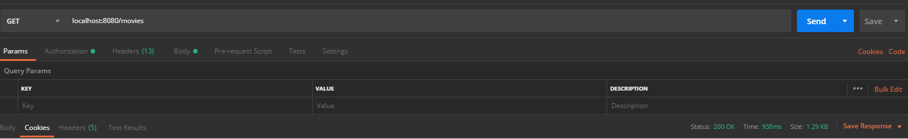

**GET movie by ID**
----
  Returns json data about a single movie found by ID.

* **URL**

  /movies/:id

* **Method:**

  `GET`
  
*  **Path variables**

   **Required:**
 
   `id=[integer]`

* **Success Response:**

  * **Code:** 200  
    **Content:** `[{ id : 1, title : title, releaseDate: "releaseDate", boxOffice : "boxOffice", genres: Genre[]}, ...]`
 
* **Error Response:**

  * **Code:** 404 Not Found Error  
    **Content:** `{ message : "Could not find movie with ID = :id." }`
    
* **Sample Call:**
    * **Error:**
    
    
    * **Success:**
    

**ADD new movie**
----
  Returns json data about a single movie added by API call.

* **URL**

  /movies

* **Method:**

  `POST`
  
* **Data params: **
   * **Required: ** 
 
   `title=[string]`
   `releaseDate=[Date]`
   `boxOffice=[double]`

  * **Optional: **
    `genres=[Genre[]]`

* **Success Response:**

  * **Code:** 200  
    **Content:** `{ id : id, title : title, releaseDate: "releaseDate", boxOffice : "boxOffice", genres: Genre[]}`
 
* **Error Response:**
  * **Code:** 500  
    
* **Sample Call:**
  * **Error:**
  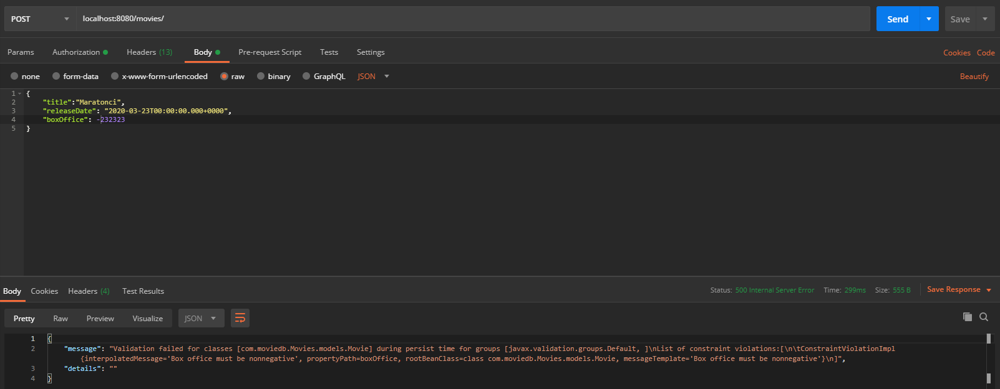
  
  * **Success:**
  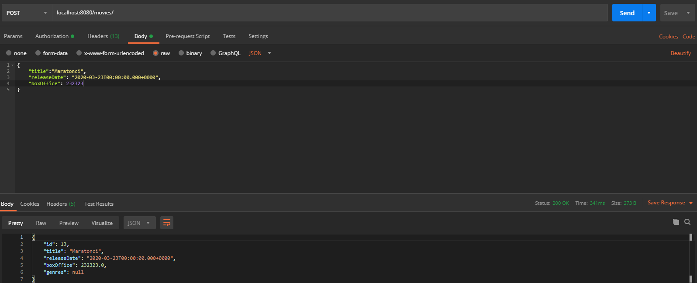
  
 **PUT movie**
----
  Returns json data about a single movie edited by API call.

* **URL**

  /movies

* **Method:**

  `PUT`
  
*  **Path variables**

   **Required:**
 
   `id=[integer]`
  
* **Data params: **
   * **Required: ** 
 
   `title=[string]`
   `releaseDate=[Date]`
   `boxOffice=[double]`

  * **Optional: **
     `genres=[Genre[]]`

* **Success Response:**

  * **Code:** 200  
    **Content:** `{ id : id, title : title, releaseDate: "releaseDate", boxOffice : "boxOffice", genres: Genre[]}`
 
    
* **Sample Call:**
  * **Success:**
  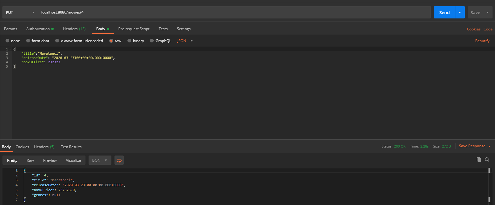
  
  * **Error:**
  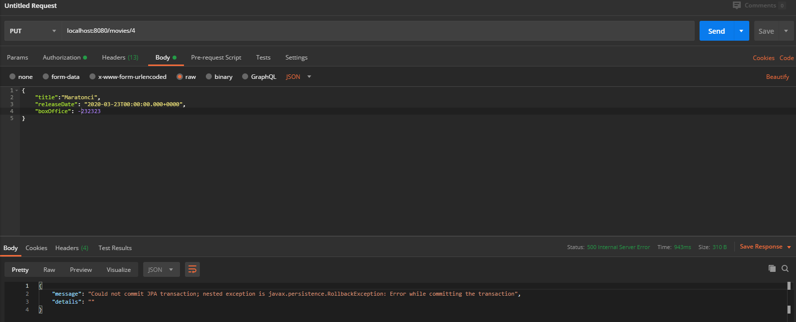
  
 **DELETE movie by ID**
----
  Deletes movie found by ID.

* **URL**

  /movies/:id

* **Method:**

  `DELETE`
  
*  **Path variables**

   **Required:**
 
   `id=[integer]`

* **Success Response:**

  * **Code:** 200  
 
* **Error Response:**

  * **Code:** 500 Internal Server Error  
    
* **Sample Call:**
  * **Success:**
  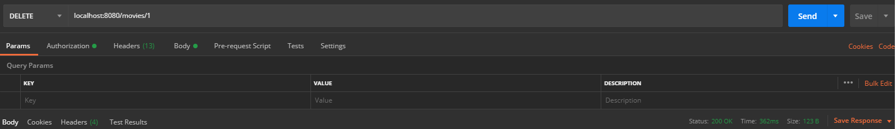
  
**GET all genres**
----
  Returns json array data about all genre records in database.

* **URL**

  /genres

* **Method:**

  `GET`
  
* **Success Response:**

  * **Code:** 200  
    **Content:** `[{ id : id, name: name, movies: Movie[]}, ...]`
 
* **Error Response:**
  
  * **Code:** 500 Internal Server Error  
    **Content:** `{ message : "...", details : "..." }`

* **Sample Call:**

**GET genre by ID**
----
  Returns json data about a single genre found by ID.

* **URL**

  /genres/:id

* **Method:**

  `GET`
  
*  **Path variables**

   **Required:**
 
   `id=[integer]`

* **Success Response:**

  * **Code:** 200  
    **Content:** `{ id : id, name: name, movies: Movie[]}`
 
* **Error Response:**

  * **Code:** 404 Not Found Error  
    **Content:** `{ message : "Could not find genre with ID = :id." }`
    
* **Sample Call:**
  * **Success:**
  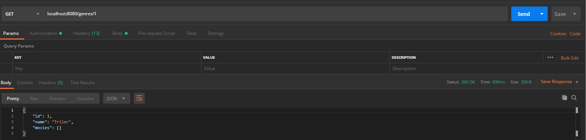
  * **Error:**
  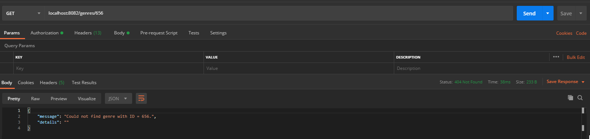
  
**ADD new genre**
----
  Adds new genre by API call.

* **URL**

  /genres

* **Method:**

  `POST`
  
* **Data params: **
   * **Required: ** 
 
   `name=[string]`

  * **Optional: **
    `movies=[Movie[]]`

* **Success Response:**

  * **Code:** 200  
    **Content:** `{ id : id, name: name, movies: Movie[]}`
 
* **Error Response:**
  * **Code:** 500  
    
* **Sample Call:**
  * **Error:**
  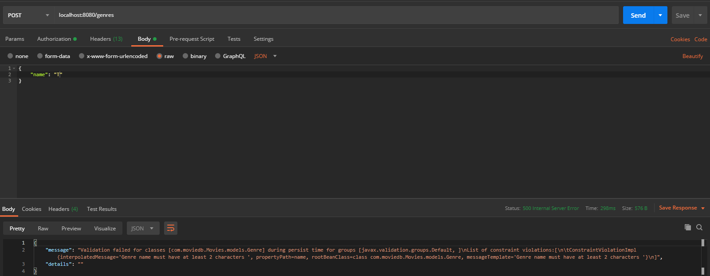
  
  * **Success:**
  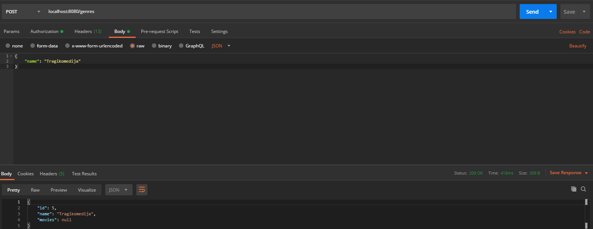
  
 **PUT genre**
----
  Returns json data about a single genre edited by API call.

* **URL**

  /genres

* **Method:**

  `PUT`
  
*  **Path variables**

   **Required:**
 
   `id=[integer]`
  
* **Data params: **
   * **Required: ** 
 
   `name=[string]`

  * **Optional: **
     `movies=[Movie[]]`

* **Success Response:**

  * **Code:** 200  
    **Content:** `{ id : id, name : name, movies: Movie[]}`
 
    
* **Sample Call:**
  * **Success:**
  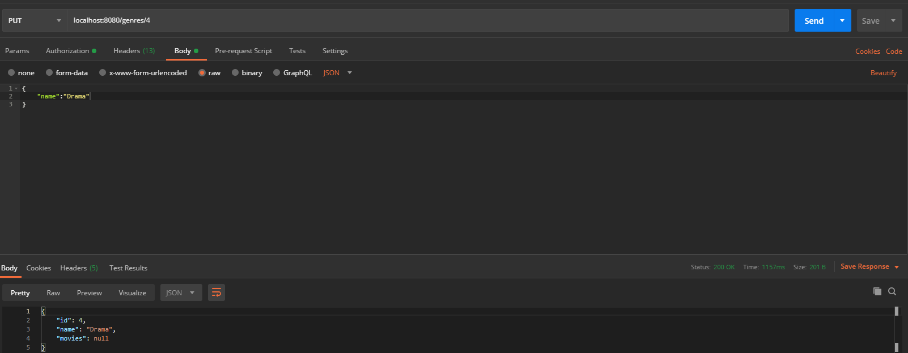
  
  * **Error:**
  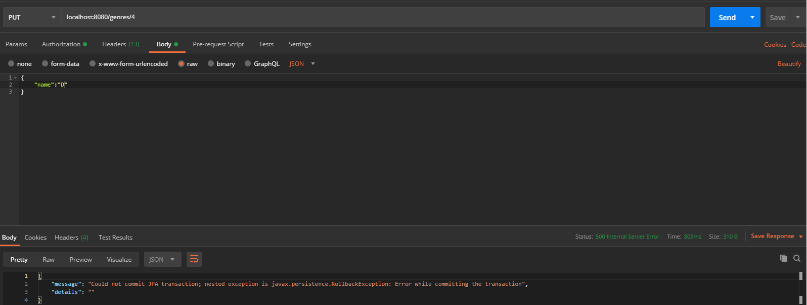
  
 **DELETE genre by ID**
----
  Deletes genre found by ID.

* **URL**

  /genre/:id

* **Method:**

  `DELETE`
  
*  **Path variables**

   **Required:**
 
   `id=[integer]`

* **Success Response:**

  * **Code:** 200  
 
* **Error Response:**

  * **Code:** 500 Internal Server Error  
    **Content:** `{ message : "Could not find genre with ID = :id." }`
    
* **Sample Call:**
  * **Success:**
  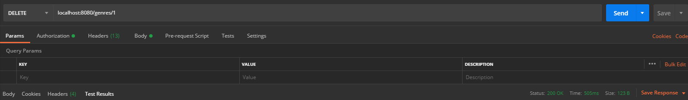
  * **Error:**
  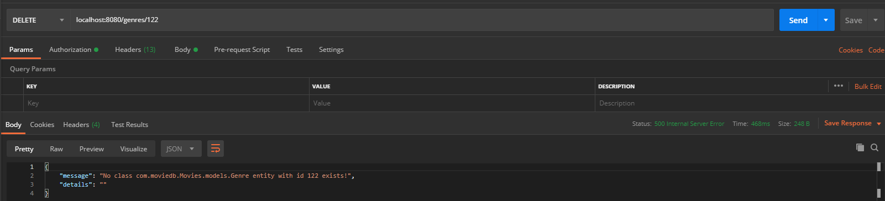
  
