**GET all users**
----
  Returns json array data about all user records in database.

* **URL**

  /users

* **Method:**

  `GET`
  
* **Success Response:**

  * **Code:** 200  
    **Content:** `[{ id : 1, username : username, password : "test_password", avatarUrl : "test_avatarUrl, role : roleObject, owners : User[], subscriber: User[], notifications: Notification[]}, ...]`
 
* **Error Response:**
  
  * **Code:** 500 Internal Server Error  
    **Content:** `{ message : "...", details : "..." }`

* **Sample Call:**

**GET user by ID**
----
  Returns json data about a single user found by ID.

* **URL**

  /users/:id

* **Method:**

  `GET`
  
*  **Path variables**

   **Required:**
 
   `id=[integer]`

* **Success Response:**

  * **Code:** 200  
    **Content:** `{ id : 1, username : username, password : "test_password", avatarUrl : "test_avatarUrl, role : roleObject, owners : User[], subscriber: User[], notifications: Notification[]}`
 
* **Error Response:**

  * **Code:** 404 Error Not Found  
    **Content:** `{ message : "Could not find user with ID = :id." }`
    
  * **Code:** 500 Internal Server Error  
    **Content:** `{ message : "..." }`
    
* **Sample Call:**

**GET user by username**
----
  Returns json data about a single user found by username.

* **URL**

  /users/:username

* **Method:**

  `GET`
  
*  **Path variables**

   **Required:**
 
   `username=[string]`

* **Success Response:**

  * **Code:** 200  
    **Content:** `{ id : 1, username : username, password : "test_password", avatarUrl : "test_avatarUrl, role : roleObject, owners : User[], subscriber: User[], notifications: Notification[]}`
 
* **Error Response:**

  * **Code:** 404 Error Not Found  
    **Content:** `{ message : "Could not find user with username = :username." }`
    
  * **Code:** 500 Internal Server Error  
    **Content:** `{ message : "..." }`
    
* **Sample Call:**
  * **Success:**
  

**ADD new user**
----
  Returns json data about a single user added by API call.

* **URL**

  /users

* **Method:**

  `POST`
  
* **Data params: **
  **Required: ** 
 
   `username=[string]`
   `password=[string]`
   `avatarUrl=[string]`

  **Optional: **
    `role=[Role]`
    `owners=[User[]]`
    `subscribers=[User[]]`
    `notifications=[Notification[]]`

* **Success Response:**

  * **Code:** 200  
    **Content:** `{ id : 1, username : username, password : "test_password", avatarUrl : "test_avatarUrl, role : roleObject, owners : User[], subscriber: User[], notifications: Notification[]}`
 
* **Error Response:**
  * **Code:** 500 Internal Server Error 
    
* **Sample Call:**
  * **Success:**
  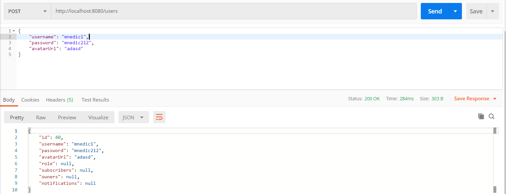
  
**EDIT existing user**
----
  Returns json data about a single user edited by API call.

* **URL**

  /users

* **Method:**

  `PUT`
  
*  **Path variables**

   **Required:**
 
   `id=[integer]`
  
* **Data params: **
   **Required: ** 
 
   `username=[string]`
   `password=[string]`
   `avatarUrl=[string]`

  **Optional: **
    `role=[Role]`
    `owners=[User[]]`
    `subscribers=[User[]]`
    `notifications=[Notification[]]`

* **Success Response:**

  * **Code:** 200  
    **Content:** `{ id : 1, username : username, password : "test_password", avatarUrl : "test_avatarUrl, role : roleObject, owners : User[], subscriber: User[], notifications: Notification[]}`
 
    
* **Sample Call:**
  * **Success:**
  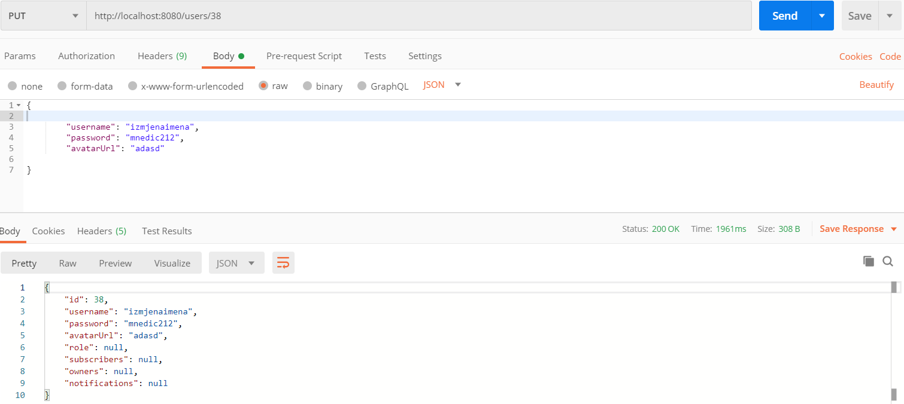
  
  * **Success (ID not found):**
  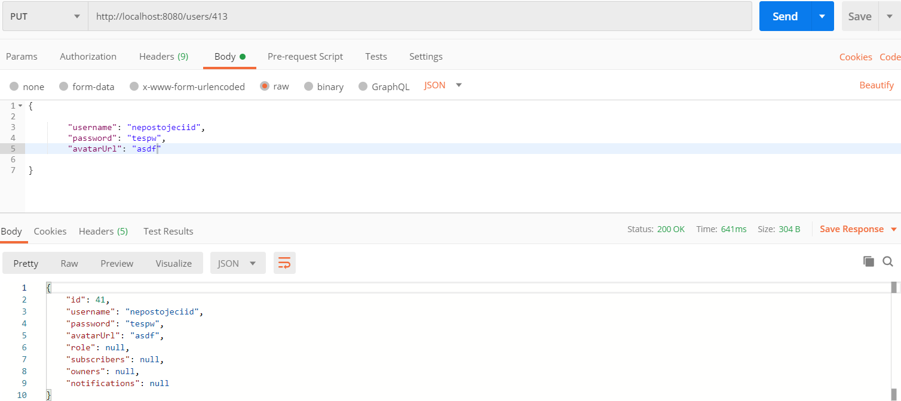
  
 **DELETE user by ID**
----
  Deletes user found by ID.

* **URL**

  /users/:id

* **Method:**

  `DELETE`
  
*  **Path variables**

   **Required:**
 
   `id=[integer]`

* **Success Response:**

  * **Code:** 200  
 
* **Error Response:**

  * **Code:** 404 Error Not Found  
    **Content:** `{ message : "Could not find user with ID = :id." }`
    
   * **Code:** 500 Internal Server Error  
    **Content:** `{ message : "..." }`
    
* **Sample Call:**
  * **Success:**
  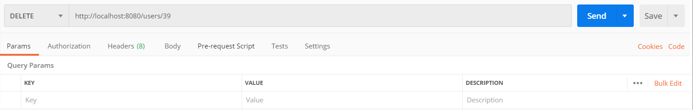
  * **Error:**
  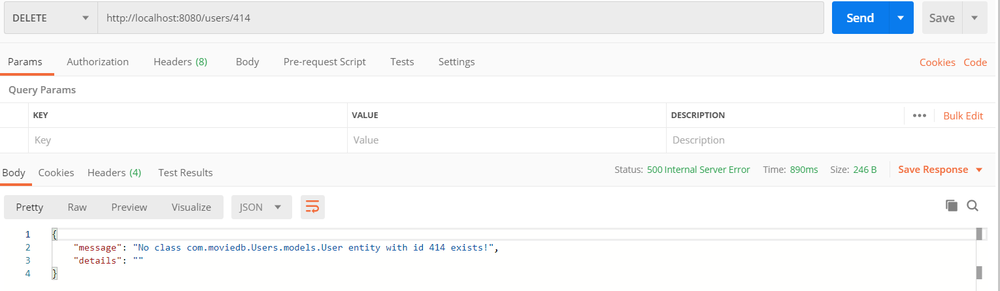
  
**GET all roles**
----
  Returns json array data about all role records in database.

* **URL**

  /roles

* **Method:**

  `GET`
  
* **Success Response:**

  * **Code:** 200  
    **Content:** `[{ id : 1, type: "rolename", users: User[]}, ...]`
 
* **Error Response:**
  
  * **Code:** 500 Internal Server Error  
    **Content:** `{ message : "...", details : "..." }`

* **Sample Call:**
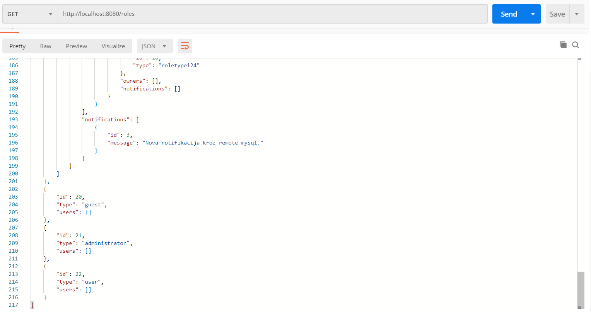

**GET role by ID**
----
  Returns json data about a single role found by ID.

* **URL**

  /roles/:id

* **Method:**

  `GET`
  
*  **Path variables**

   **Required:**
 
   `id=[integer]`

* **Success Response:**

  * **Code:** 200  
    **Content:** `{ id : id, type: "rolename", users: User[]}`
 
* **Error Response:**

  * **Code:** 404 Error Not Found  
    **Content:** `{ message : "Could not find user with ID = :id." }`
    
  * **Code:** 500 Internal Server Error  
    **Content:** `{ message : "..." }`
    
* **Sample Call:**
  * **Success:**
  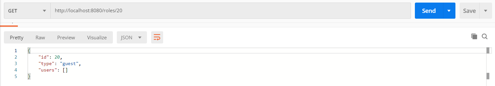
  * **Error:**
  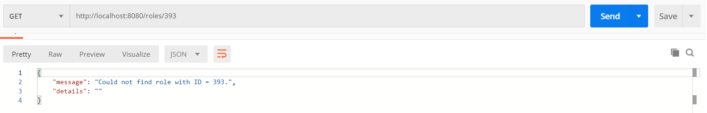
  
**GET role by type**
----
  Returns json data about a single role found by type.

* **URL**

  /roles/identification/:type

* **Method:**

  `GET`
  
*  **Path variables**

   **Required:**
 
   `type=[string]`

* **Success Response:**

  * **Code:** 200  
    **Content:** `{ id : 1, type: :type", users: User[]}`
 
* **Error Response:**

  * **Code:** 404 Error Not Found  
    **Content:** `{ message : "Could not find user with type = :type." }`

  * **Code:** 500 Internal Server Error  
    **Content:** `{ message : "..." }`
    
* **Sample Call:**
  * **Success:**
  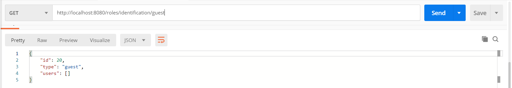
  * **Error:**
  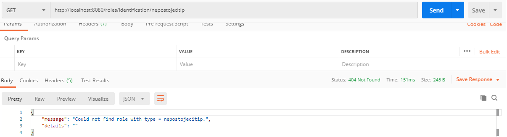
  
**ADD new role**
----
  Returns json data about a single role added by API call.

* **URL**

  /roles
* **Method:**

  `POST`
  
* **Data params: **
   * **Required: ** 
 
   `type=[string]`

  * **Optional: **
    `users=[User[]]`

    
* **Success Response:**

  * **Code:** 200  
    **Content:** `{ id : 1, type : "type", users : User[]}`
 
* **Error Response:**
  * **Code:** 500 Internal Server Error 
    
* **Sample Call:**
  * **Success:**
  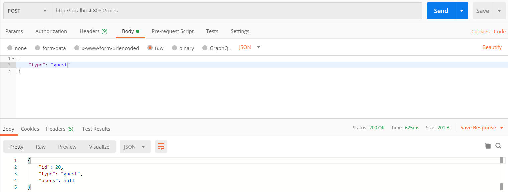
  
**EDIT existing role**
----
  Returns json data about a single role edited by API call.

* **URL**

  /roles

* **Method:**

  `PUT`
  
*  **Path variables**

   **Required:**
 
   `id=[integer]`
  
*  **Data params: **
   **Required: ** 
 
   `type=[string]`

   **Optional: **
    `users=[User[]]`

* **Success Response:**

  * **Code:** 200  
    **Content:** `{ id : 1, type : "type", users : User[]}`
 
    
* **Sample Call:**
  * **Success:**
  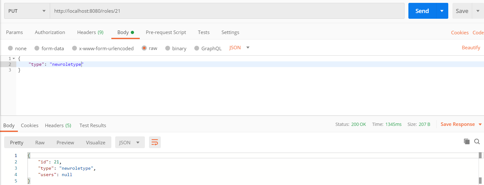
 
 
 **DELETE role by ID**
----
  Deletes role found by ID.

* **URL**

  /roles/:id

* **Method:**

  `DELETE`
  
*  **Path variables**

   **Required:**
 
   `id=[integer]`

* **Success Response:**

  * **Code:** 200  
 
* **Error Response:**

  * **Code:** 404 Error Not Found  
    **Content:** `{ message : "Could not find role with ID = :id." }`
    
   * **Code:** 500 Internal Server Error  
    **Content:** `{ message : "..." }`
    
* **Sample Call:**
  * **Success:**
  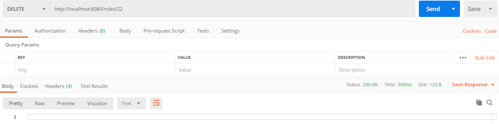
  * **Error:**
  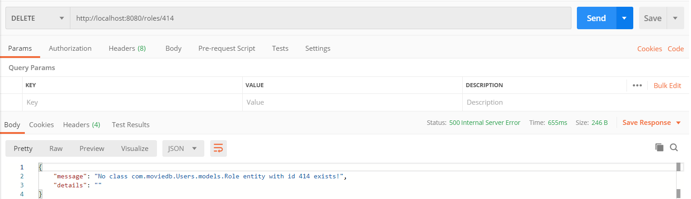
  
**GET all notifications**
----
  Returns json array data about all notification records in database.

* **URL**

  /notifications

* **Method:**

  `GET`
  
* **Success Response:**

  * **Code:** 200  
    **Content:** `[{ id : 1, ownerUser : User, message : "message"}, ...]`
 
* **Error Response:**
  
  * **Code:** 500 Internal Server Error  
    **Content:** `{ message : "...", details : "..." }`

* **Sample Call:**
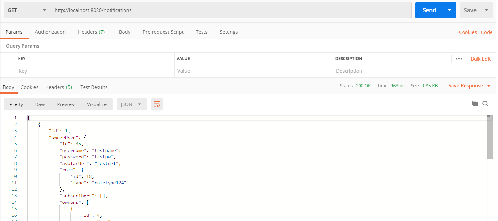

**GET notification by ID**
----
  Returns json data about a single notification found by ID.

* **URL**

  /notifications/:id

* **Method:**

  `GET`
  
*  **Path variables**

   **Required:**
 
   `id=[integer]`

* **Success Response:**

  * **Code:** 200  
    **Content:** `{ id : id, ownerUser : User, message : "message"}`
 
* **Error Response:**

  * **Code:** 404 Error Not Found  
    **Content:** `{ message : "Could not find nofitication with ID = :id." }`
    
  * **Code:** 500 Internal Server Error  
    **Content:** `{ message : "..." }`
    
* **Sample Call:**
  * **Success:**
  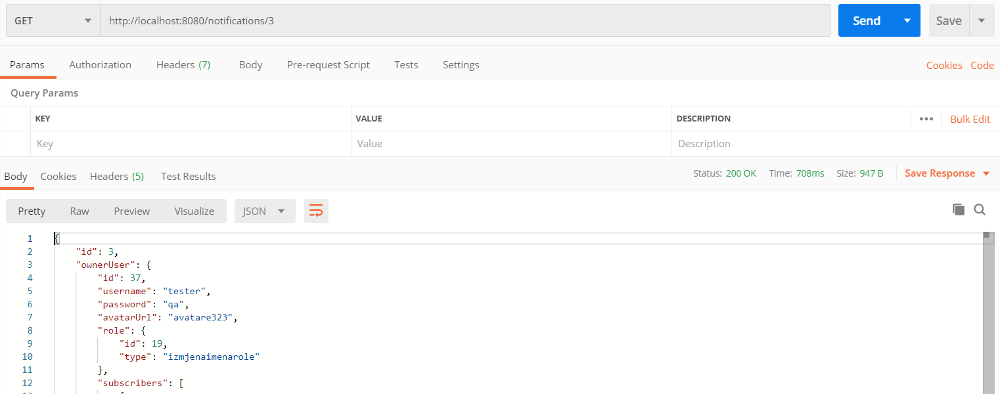
  * **Error:**
  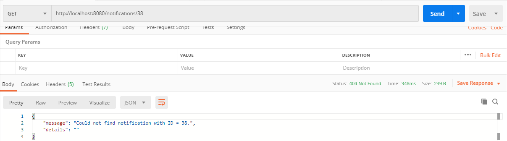
  
 **GET notifications by owner user ID**
----
  Returns json data about notification(s) found by owner user ID.

* **URL**

  /notifications/identification/:id

* **Method:**

  `GET`
  
*  **Path variables**

   **Required:**
 
   `id=[integer]`

* **Success Response:**

  * **Code:** 200  
    **Content:** `[{ id : 1, ownerUser : User, message : "message"}, ...]`
 
* **Error Response:**

  * **Code:** 404 Error Not Found  
    **Content:** `{ message : "Could not find notification with owner user ID = :id." }`

  * **Code:** 500 Internal Server Error  
    **Content:** `{ message : "..." }`
    
* **Sample Call:**
  * **Success:**
  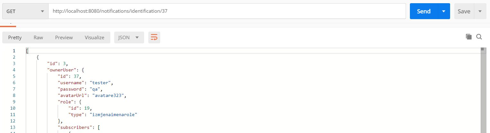
  * **Error:**
  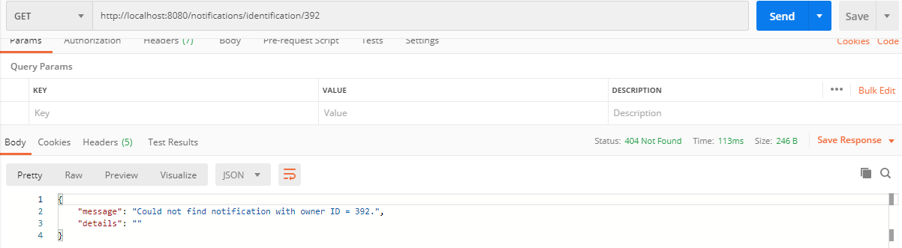
  
**ADD new notification**
----
  Returns json data about a single notification added by API call.

* **URL**

  /notifications
* **Method:**

  `POST`
  
* **Data params: **
   **Required: ** 
 
   `message=[string]`
   `ownerUser=[User]
    
* **Success Response:**

  * **Code:** 200  
    **Content:** `{ id : 1, message : "message", ownerUser : User}`
 
* **Error Response:**
  * **Code:** 500 Internal Server Error 
    
* **Sample Call:**
  * **Success:**
  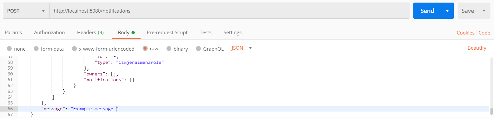
  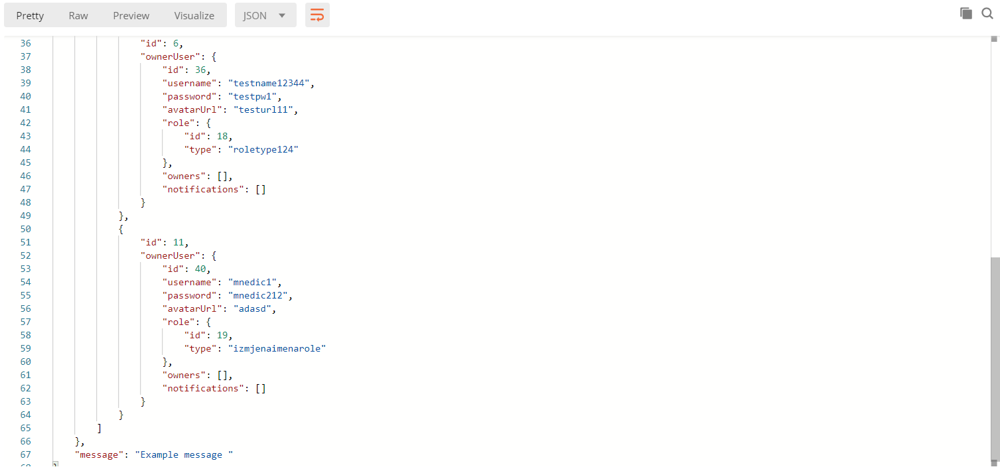
  * **Error:**
  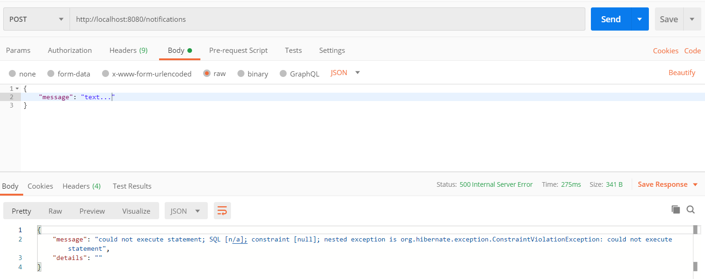
   
 **DELETE notification by ID**
----
  Deletes notification found by ID.

* **URL**

  /notifications/:id

* **Method:**

  `DELETE`
  
*  **Path variables**

   **Required:**
 
   `id=[integer]`

* **Success Response:**

  * **Code:** 200  
 
* **Error Response:**

  * **Code:** 404 Error Not Found  
    **Content:** `{ message : "Could not find notification with ID = :id." }`
    
   * **Code:** 500 Internal Server Error  
    **Content:** `{ message : "..." }`
    
* **Sample Call:**
  * **Success:**
  
  * **Error:**
  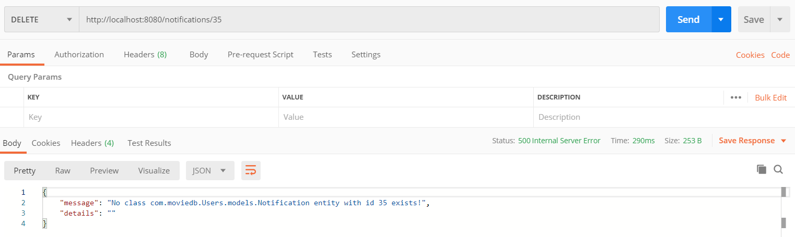

