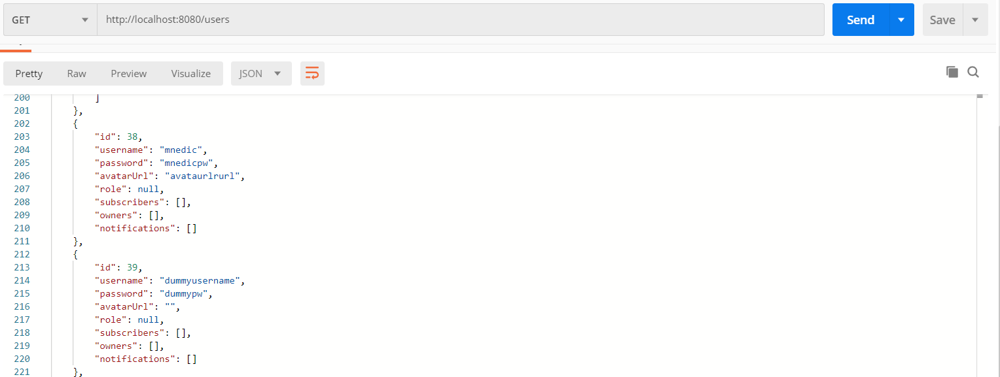
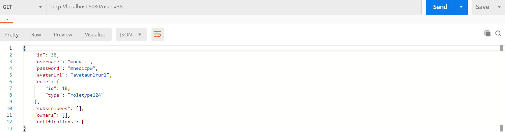
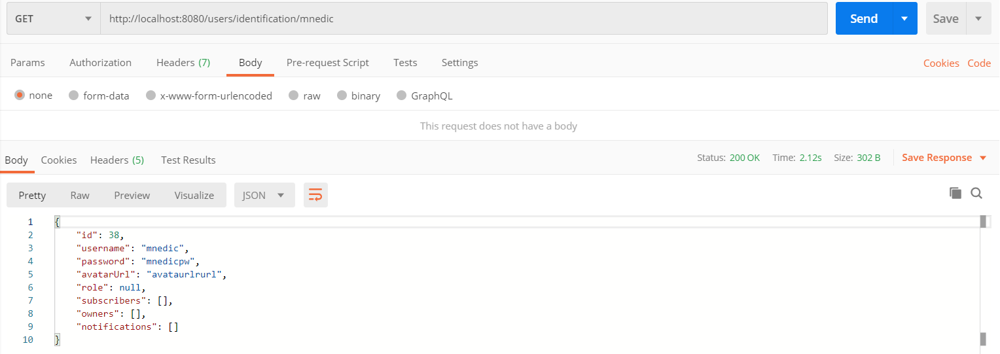

**GET all users**
----
  Returns json array data about all user records in database.

* **URL**

  /users

* **Method:**

  `GET`
  
* **Success Response:**

  * **Code:** 200  
    **Content:** `[{ id : 1, username : "test_username", password : "test_password", avatarUrl : "test_avatarUrl, role : roleObject, owners : User[], notifications: User[]}, ...]`
 
* **Error Response:**
  
  * **Code:** 500 Internal Server Error  
    **Content:** `{ message : "...", details : "..." }`

* **Sample Call:**

**GET user by ID**
----
  Returns json data about a single user found by ID.

* **URL**

  /users/:id

* **Method:**

  `GET`
  
*  **URL Params**

   **Required:**
 
   `id=[integer]`

* **Success Response:**

  * **Code:** 200  
    **Content:** `{ id : id, username : "test_username", password : "test_password", avatarUrl : "test_avatarUrl, role : roleObject, owners : User[], notifications: User[]}`
 
* **Error Response:**

  * **Code:** 500 Internal Server Error  
    **Content:** `{ message : "Could not find user with ID = :id." }`
    
* **Sample Call:**

**GET user by username**
----
  Returns json data about a single user found by username.

* **URL**

  /users/:username

* **Method:**

  `GET`
  
*  **URL Params**

   **Required:**
 
   `username=[String]`

* **Success Response:**

  * **Code:** 200  
    **Content:** `{ id : 1, username : username, password : "test_password", avatarUrl : "test_avatarUrl, role : roleObject, owners : User[], notifications: User[]}`
 
* **Error Response:**

  * **Code:** 500 Internal Server Error  
    **Content:** `{ message : "Could not find user with username = :username." }`
    
* **Sample Call:**
  * **Success:**
  

